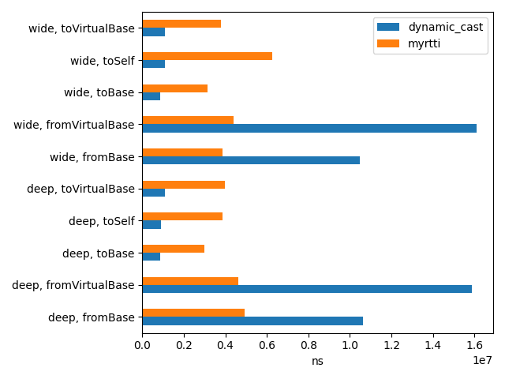

# MyRTTI Solution
*This is a C++ RTTI solution with full access to classes hierarchy and minimum
addional coding for classes definition.*

## The goals and problems of RTTI
*RTTI stands for Run-Time Type Information.*

### Goal
Assuming we have a set of pointers of some `Base*`, I want to figure out its real type and do some appropriate actions.

E.g.
```c++
void foo(Shape* obj) {
   if (isa<Circle>(obj)) {
      cout << "This is a Circle!\n";
   }
}
```

Which is more interesting I also want to make a cast, so example from above takes following form:

```c++
void foo(Shape* obj) {
   if (auto* circle = cast<Circle>(obj)) {
      circle->printWhoAmI();
   }
}
```

In order to do it we need two things:
1. For each object we should store information about its real type (aka RTTI).
   * NOTE: For proper cross-casting we also should keep track of pointers to all its parents. Assuming base class is virtual we can't use `static_cast` for converting `Shape` to `Circle` in example above.
   * NOTE#2: More over ideally it stores whole types hierarchy.
2. Also we need to assosiate the same information with each class. And we should be able to resolve it in run-time as well.
3. Going even further I want be able to *walk* through whole hierarchy. Doing this I can implement things like *visitor with fallbacks to parents*, constructor-like mechanics and many other things.

### Problem
Problem is that there is a quite restricted rtti support in C++.
* If enabled, it is applied to all classes and structures. Whilst we would prefer to disable it for traits.

   ...Or rather, we would prefer to enable it for restricted subset of classes, where we really need it.
* Even though you're able to perform cross-casts, there is still no way for simple visitor implementation.

As a conclusion whenever your aim are goals from above, you have to implement boiler plate code, add extra syntax, and sometimes even introduce additional codegen phases.

## Some existing RTTI solutions
### LLVM, classof
*A very simple and fast RTTI solution.*

   (*details: [LLVM-style RTTI, Basic Setup](https://llvm.org/docs/HowToSetUpLLVMStyleRTTI.html#basic-setup)*)

   ```c++
   class Shape {
   public:
      /// Discriminator for LLVM-style RTTI (dyn_cast<> et al.)
      enum ShapeKind {
         SK_Square,
         SK_Circle
      };
   private:
      const ShapeKind Kind;
   public:
      ShapeKind getKind() const { return Kind; }
      Shape(ShapeKind K) : Kind(K) {}

      // class body
   };

   class Square : public Shape {
      double SideLength;
   public:
      Square(double S) : Shape(SK_Square), SideLength(S) {}

      // class body
   };

   void usage() {
      Shape *S = ...;

      // "isa" picks S->Kind and compares it with SK_Circle
      if (isa<Circle>(S)) {/* do something ... */}
   }
   ```

   * Pros
      * Very fast casting (single comparison CPU instruction)
      * Very simple tools usage (`isa`, `cast` and others), once you implemented class properly though.
   * Cons:
      * Extra coding in parent and child:
         * You have to extend enum with child class codes in RTTI root class.
         * In child constructors you should pass this enum value to a parent.
      * It doesn't support full class hierarchy. Having pointer to rtti root
         you only can get access to top-most child class.
      * Can't be used if final hierarchy is not known. For example root is
         defined in library, whilst children is to be defined is yet-unknown
         library-user apps.
### LLVM, RTTIExtend
   *An alternative to previous solution when the final hierarchy is not known*

   (*details: [LLVM-style RTTI, RTTI for Open Class Hierarchies](https://llvm.org/docs/HowToSetUpLLVMStyleRTTI.html#rtti-for-open-class-hierarchies)*)


   ```c++
   template <typename ThisT, typename ParentT>
   class RTTIExtends : public ParentT {
   public:
      // Inherit constructors from ParentT.
      using ParentT::ParentT;
      static const void *classID() { return &ThisT::ID; }
      const void *dynamicClassID() const override { return &ThisT::ID; }

      bool isA(const void *const ClassID) const override {
         return ClassID == classID() || ParentT::isA(ClassID);
      }
   };

   class Shape : public RTTIExtends<Shape, RTTIRoot> {
   public:
      static char ID;
      // class body
   };

   class Square : public RTTIExtends<Square, Shape> {
   public:
      static char ID;
      // class body
   };

   char Shape::ID = 0;
   char Square::ID = 1;
   ```

   * Pros:
      * Much easier to design children:
         1. Inherit from RTTIExtends.
         2. Setup `child::ID` static variable.
      * No need to update parent classes.
   * Cons:
      * Still doesn't support hierarchy, but potentially it might be improved though.
      * You still have to keep track of extra `child::ID`.
### XNU, OSMetaClass

   (*details: [IOKit Funamentals -> Runtime Type Information (OSMetaClass)](https://developer.apple.com/library/archive/documentation/DeviceDrivers/Conceptual/IOKitFundamentals/BaseClasses/BaseClasses.html#//apple_ref/doc/uid/TP0000016-CJBFJECG)*)

   Introduces two macros (complicated ones):
   * `OSDeclareDefaultStructors` - generates constructor prototype
   which accepts child class name.
   * `OSDefineMetaClassWithInit` - accepts className and superClass,
   resolves link to superClass meta information and stores it in childClass instance.

   Usage:
   ```c++
   // .h
   class MyDriver : public IOEthernetController
   {
      OSDeclareDefaultStructors(MyDriver);
      // class body
   };

   // .cpp

   #include "MyDriver.h"
   OSDefineMetaClassAndStructors(MyDriver, IOEthernetController);

   // rest of definitions
   ```

   * Pros:
      * No need to update parent classes.
      * Keeps hierarchy
   * Cons:
      * You still need to put extra code in two places: .h and .cpp
      * Multiple inharitance is not supported

### UnrealEngine, UObject

   Uses additional code generator which injects class hierarchy into class static fields, injects type information during instance construction.

   ```c++
   // .h
   #pragma once

   #include 'Object.h'
   #include 'MyObject.generated.h'
   UCLASS()
   class MYPROJECT_API UMyObject : public UObject
   {
      GENERATED_BODY()
   };

   // .cpp
   // ...
   void usage() {
      UClass* ClassA = UDamageType::StaticClass();

      TSubclassOf<UDamageType> ClassB;

      // Performs a runtime check
      ClassB = ClassA;
   }
   ```

   (*details: [UE Documentation, Objects](https://docs.unrealengine.com/5.1/en-US/objects-in-unreal-engine/)*)
   * Pros:
      * Keeps hierarchy.
      * All RTTI-related definitions are gathered in .h file.
      * No need to update parent classes.
   * Cons:
      * It it uses extra code generator to maintain RTTI stuff.
      * Proprietary, and we only can suppose what's behind some macros.

## Our solution: MyRTTI
Our solution assumes single declaration point principle. So, there is only one
point in code, where you mark class as a *runtime*:
* If you're declaring class without macros, then you put few marks in the beginning of class. There is still word "few". And yet (for each class) there is only one place where all those "few" are gathered.
* If you're mentally prepared to suffer using macros, then we can turn it into a single point indeed (see below).

So the benefits all together are:
* No need to put extracode in .cpp files
* No need to edit parent class
* Minimal extra code in the beginning of child class
* No need to put extra code in class constructors or other methods.

### Example

#### figures.h
```c++
#include <myrtti.h>

using namespace myrtti;

struct Shape : RTTI<Shape>
{
    DEFINE_RTTI(Shape, Object);

    // class body
    // ...
};

struct Square : Shape, RTTI<Square>
{
    DEFINE_RTTI(Square, Shape);

    // class body
    // ...
};
```

#### main.cpp

```c++
#include <iostream>
#include <memory>
#include <vector>

#include "figures.h"

using namespace std;

int main() {
    vector<shared_ptr<Object>> objs = {
        make_shared<Shape>(),
        make_shared<Square>(),
    };

    for (auto &o : objs) {
        cout << "o->rtti->name = " << o->rtti->name << "\n";

        if (o->rtti == Square::info()) {
            cout << "Discovered Square\n";
        }
    }
    return 0;
}
```

As you can see all RTTI-related marks are gathered in the beginning of class
declaration. If you're not too disdained about macros we could rewrite
structure declaration with rtti into this:

```c++
RTTI_STRUCT_BEGIN(Square, (Shape /*need more parents?*/))
    // Structure body here
    // ...
    virtual float area() = 0;

    private:
    // Private members here
    // ...
RTTI_STRUCT_END()
```

Pros and cons of using such macros

Pros
* This is a real single-point definition!

Cons
* Syntax is ugly. In general such macros set supports `struct` only, because there
are issues with stripping access/virtual modifiers from parents set. We prefer RTTI parents to be *public*, whilst for `class` it is *protected* by default.

Well, anyways, in most of tasks we can live with that.

### Magic behind

Let's take a look at internals. There are few key things:

* `ClassInfo` - Describes all runtime information available for given class.
   ```c++
   // asdasd
   namespace myrtti {
   struct ClassInfo {
      const char* name;
      // ...
      template<typename ArrayT>
      ClassInfo(
         const char* name,
         class_id_t classId,
         const ArrayT& parents
      )
      : name(name), id(classId) {
         Hierarchy::instance()->add(this, parents);
      }
      // ...
   };
   }
   ```
* `Object` - All classes with RTTI are inherited from `Object`. This is implicitly done when you inherit from `RTTI` class marker. `Object` is a place where we hold runtime type information (pointer to `ClassInfo` instance).
   ```c++
   struct Object {

      // Each descendant have its own info() static method.
      static const ClassInfo* info() {
         static ClassInfo v("Object");
         return v;
      }

      // Descendants will override rtti value.
      // Each object will have its own rtti value.
      const ClassInfo* rtti = info();

      // Cross cast implementation
      template<class T>
      T* cast() {
         auto found = this->crossPtrs.find(T::info());
         if (/*[[likely]]*/ found != end(this->crossPtrs))
               return static_cast<T*>(found->second);
         return nullptr;
      }

      template<class T> const T* cast() const {/*...*/}

   protected:
      // This friendship provides access to crossPtrs for RTTI specs.
      template<class T> friend class RTTI;

      std::unordered_map<const ClassInfo*, void*> crossPtrs;
   };
   ```
* `RTTI` - We force each class (`ClassT`) to inherit from `RTTI<ClassT>`. This template defines default constructor `RTTI()`, which:
   * intializes runtime information with `ClassInfo* ClassT::info()` call.
   * registers pointer casted to `ClassT` (at this point we can use `static_cast`), so we could do cross-casts.

   Important note: `RTTI()` is implicitly called in *all* `ClassT` constructors, and there is no need to put extracode (e.g. in .cpp files) in such constructors.
   ```c++
   template <class T>
   struct RTTI : virtual Object {
      RTTI() {
         auto *superSelf = static_cast<T*>(this);
         this->rtti = T::info();
         this->crossPtrs[this->rtti] = superSelf;
      }
   };
   ```
* `DEFINE_RTTI` - this macro should be called in body of new class, and it generates that `info()` static method. In this method it creates static `ClassInfo` instance for new class, and associates it with `ClassInfo` instances of all its parents, forming *hierarchy DAG*.
   ```c++
   #define DEFINE_RTTI(cn, ...) \
      static const ClassInfo* info() { \
         static ClassInfo v(#cn, ClassInfo::mk_class_info_array<__VA_ARGS__>()); \
         return v; \
      }
   ```
* `Hierarchy` - this is basically a wrapper around `DAG<ClassInfo*>` with `Hierarchy* instance()` singleton.

   It also provides some adoptations of DSF calls of this DAG.

   Below in the description of *visitor* pattern we will see it in action.

### Restrictions

#### Non-virtual inheritance
Even though `myrtti::Object` is virtual, we restrict our solution to use only non-virtual inharitence so far.

The reason is that we still didn't check all the consequencies if we enable virtual parents.

#### RTTI_STRUCT is... struct
As we said, for heavy `RTTI_STRUCT_xxx` macros are possible for *structs* only.

#### Anything else?
Who knows? Better to keep this part vacant than absent at all.

### Benchmarks
We didn't aim to achieve super performance but rather reach functionality. And yet we made few synthetics benchmarks.

We used google benchmarks on following machine:
```
8 X 4700 MHz CPU s
CPU Caches:
  L1 Data 32K (x8)
  L1 Instruction 32K (x8)
  L2 Unified 256K (x8)
  L3 Unified 12288K (x1)
```
Though we're rather interested in relative results, so exact machine doesn't matter that much.

As a compiler we `clang-10` with `-O3` optimization flags set.

We used two exterme hierarchies:
* *Wide* - final class has only one generation, but multiple parents.
* *Deep* - final class has multiple generations, but only one ancestor for each generation.

We compared `myrtti::dyn_cast` with `dynamic_cast`. For both solutions we launched casts 10^6 times.

As long as we use [`unordered_map`](https://en.cppreference.com/w/cpp/container/unordered_map) to keep ancestor pointers,
we expect constant time for all our cast operations with rare collisions.

So let's take a look at benchmarks:



*(note that you can reproduce it by running `compare_casts_plot` target)*

Here are few notes.

#### 1. Our from-base casts seems to beat dynamic_cast
We should be very accurate with conclusions when we beat some legacy well-optimized thing.
But if its true.. well then "YAY!" those would be a great news!

But let others to confirm this fact. Optimized results might be context dependent. For example,
it might be merged with some user's code, or inlined into some user's function. And it might affect
final result quite dramatically.

#### 2. In case of hash (single) collision our solution becomes 2 times slower
See `wide, toBase` cast, we have done some observations and discovered that the reason is a hash collision.

So far we're using `ClassInfo*` as a key, and that was actually a bad idea. We could use
Class::class_id instead (which is CRC64 of class name). So let's work on it!

#### 3. `dynamic_cast` beats us on *to-base* casts
This is because it might be optimized down to `static_cast`.

Let's try to introduce `Class::parents` constexpr array which will hold *class_id*s of all its
*rtti*ed parents (non-virtual).

So here we still have a chance to match it.

### Visitor
Our version of visitor might be illustrated by following example:
```c++
    Visitor visitor(
        [](const Exception& e) {
            cout << "TEST EXCEPTION: Exception, msg: " << e.message << "\n";
            return true;
        },
        [](const ExceptionErrorOne& e) {
            cout << "TEST EXCEPTION: ExceptionOne.\n";
            return true;
        },
        [](const ExceptionErrorTwo& e) {
            cout << "TEST EXCEPTION: ExceptionTwo.\n";
            return true;
        }
    );

    visit(ExceptionErrorTwo());
```
Here `ExceptionXXX` are user-defined classes with *myrtti* information.

So falling back to classic visitor pattern all *accept* methods are defined as
lambdas.

#### Construction stage
On construction stagee *Visitor* uses
[template parameters pack](https://en.cppreference.com/w/cpp/language/parameter_pack)
+ [fold expressions](https://en.cppreference.com/w/cpp/language/fold) to retrieve type information
(`myrtti::ClassInfo`) and associate it with user-defined handler.

Below is simplified code:
```c++

struct Visitor {
   template<class ...Lambda>
   explicit Visitor(Lambda&& ...L) {
      init(std::function(L)...); // Trick to extract actual lambda prototypes.
   }

   template<class ...Cls>
   void init(
      // Here we able to retrieve exact class provided
      // by used for this handler.
      // Thus we're able to call access its Cls::class_id.
      std::function<bool(Cls&)>&& ...visitors
   ) {
      (
         [&] {
            visitorsMap.emplace(Cls::class_id,
               [=] (Object& b) {
                     Cls& bb = b.template cast<Cls>();
                     return visitors(bb);
               }
            );
         } (), ...
      );
   }
   // ...
};
```

#### "visit" stage

`Visitor::visit` can be called for objects with [*type erasure*](https://en.wikibooks.org/wiki/More_C%2B%2B_Idioms/Type_Erasure) applied. In another words you can apply it for `Object` references.

So. Once we call `Visitor::visit(o)`, we do following:
1. within `o->rtti` we extract runtime
information
2. walk through object types *hierarchy* (rememember `Hierarchy::instance()->add`?)
3. check for `visitorsMap` whether we have handler attached to one of its ancesors.
4. If parent found we call it.

So event if there is *no* handler for exact type of object `o` we're still able
to check for its parent types.

Simplified code:
```c++
    bool visit(Object& b) {
        bool neverVisited = Hierarchy::instance()->unwind(
            b.rtti->getId(),
            [&] (const ClassInfo* cls) {
                auto found = visitorsMap.find(cls->getId());
                if (found != end(visitorsMap)) {
                    // By returning false we force visitor to continue
                    // unwinding search.
                    bool visitHandled = found->second(b);
                    return !visitHandled;
                }
                return true;
            }
        );
        return !neverVisited;
    }
```

#### Immutable/Muttable modes.

Our visitor pattern allows to work in two modes:
* Immutable (default). In this mode we must pass objects by constant reference.
E.g. (`const ExceptionOne& e`).
* Mutable. In this object we must pass objects without `const` qualifier.
   In order to activate this mode you should define visitor with `false` template parameter:
   ```c++
   Visitor</*immutable=*/false> visitor(
        [](Exception& e) { /*...*/ return true; }
        // ...
   );
   ```
### Futher work
All above should rather considered as a design proposal for RTTI + Visitors in C++.

We hope we will able to maintain this library and adopt it to generic use-cases.

In nearest future we hope to imporove performance of `cast` for cases when it is replacable with `static_cast`.

Also we consider to experiment with partial *reflection* features, like invoking methods by name.

As another direction we're checking possibility to implement *clang* and *gcc* plugins so we could replace `RTTI_STRUCT_XXX` macros with `[[myrtti::add_runtime]]` attribute (or something similar)

# That's it
Thank you for reading.

And, we're looking forward for your feedback!
